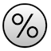
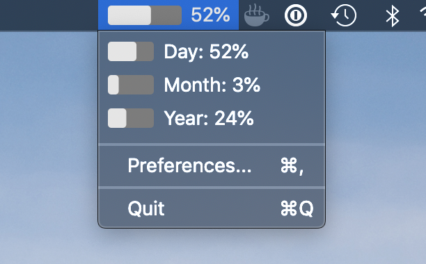
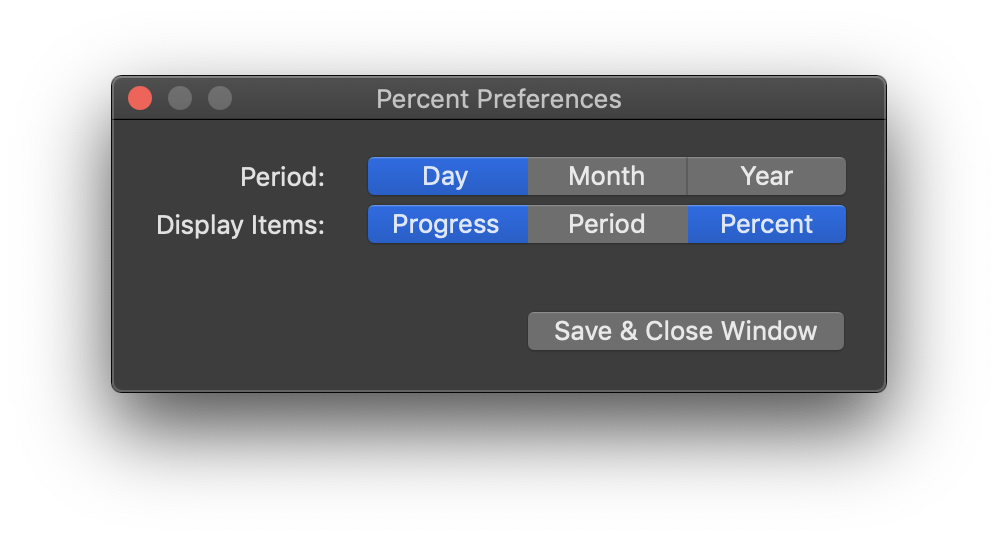

# Percent  
> Menu bar applet for tracking time as a percent

Keep track of the day, month, or year in percent form. A simple app that lives in the menu bar presents an alternative view of the passing of time. May induce mild existential angst.

## Installation
Just grab the latest release from the releases tab, or build from source following the instrutions below.

## Building
Open the project in Xcode and build. No need to do anything else.

## Settings

- **Period**: Select one for display in the System Menu
	- *Day*
	- *Month*
	- *Year*
- **Display Items**: If none are selected, defaults to "%"
	- *Progress*: A progress bar for the period selected above
	- *Period*: The name of the time period being measured
	- *Percent*: The percent value of time elapsed

## License
`Percent` is available under a GPLv3 license. See the LICENSE file for more details.

## Dependencies
- [JCGGProgressBar](https://github.com/jacquesCedric/JCGGProgressBar) - Custom progress bar component, MIT licence